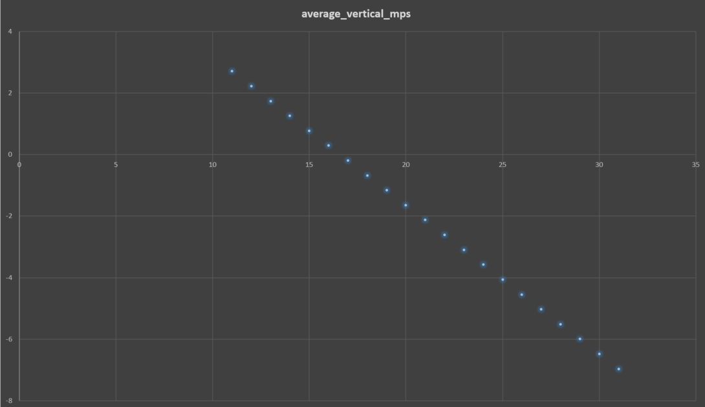

## AF vertical speed vs rhythm
- only the frequency of jumpslashes matters for y speed afaict
- avg y speed vs rhythm is linear, gravity is the only factor and always in effect (not positive whether gravity procs on jumpslash cancel frame though)
- (bpm is probably more practical for human play. I think you could derive bpm from this though)

af-vertical-speed.mp4 <a href="../media/af-vertical-speed.mp4" download>(download)</a>
<video src="../media/af-vertical-speed.mp4" controls></video>



~~repeating ZR=13 Y=3 twice + ZR=14 Y=3 thrice is expected to be almost flat, at ~0.6mm/s down. (-0.00301589m / 5s)~~
hmm lag frames might be causing extra gravity, not quite as level as i hoped.
Ohh also I calced for 2s+3s, but I can't scale it to 2+3 iterations like that because 16+17 aren't same duration <:thonk:1212193436695007282>

af-vertical-hover.mp4 <a href="../media/af-vertical-hover.mp4" download>(download)</a>
<video src="../media/af-vertical-hover.mp4" controls></video>

so there are 3 obvious AF hovers. below shows expected y delta per whatever the hover cycle is. videos show the y coord at each full cycle. still not as stable as projected but i think i can blame lag frames this time
```py
>>> 2*ydiffs[16] + 3*ydiffs[17] # ^ ZR=13 Y=3 twice + ZR=14 Y=3 thrice. ~2.77s cycle
-0.021728499999999984

>>> 1*ydiffs[11] + 9*ydiffs[17] # ~5.47s cycle
0.001220720000000064

>>> 28*ydiffs[12] + 13*ydiffs[22] # ~20.73s cycle
0.00048759999999958836
```

af-vertical-hover2.mp4 <a href="../media/af-vertical-hover2.mp4" download>(download)</a>
<video src="../media/af-vertical-hover2.mp4" controls></video>

af-vertical-hover3.mp4 <a href="../media/af-vertical-hover3.mp4" download>(download)</a>
<video src="../media/af-vertical-hover3.mp4" controls></video>

```
(assuming fixed 30fps gameplay -- alternates might be lag frames? only reporting alts seen >1fr)

jumpslash_cancel_every_n_frames, average_vertical_mps
- 11: 2.705966
- 12: 2.2229004 or 2.22229?
- 13: 1.7392203
- 14: 1.2555803 or 1.2561035
- 15: 0.77246094
- 16: 0.28930664
- 17: -0.19387639 or -0.19430721
- 18: -0.67749023
- 19: -1.1606959
- 20: -1.6442871 or -1.6439209
- 21: -2.1275113
- 22: -2.6107512
- 23: -3.0940049
- 24: -3.5772705 or -3.5775757
- 25: -4.0608397 or -4.060547
- 26: -4.544114
- 27: -5.027398
- 28: -5.5106897
- 29: -5.9942417 or -5.993989
- 30: -6.477539 or -6.477295
- 31: -6.960843
- 32: -7.444153 or -7.4440384
- 33: -7.927468 or -7.927357

>>> 2*speeds[16] + 3*speeds[17]
-0.003015890000000021
~~(so repeating ZR=13 Y=3 twice + ZR=14 Y=3 thrice is almost flat)~~ <-- these are iterations ^ those are seconds, thats not how scaling works but its still somewhat flat.


jumpslash_cancel_every_n_frames, ydiff_per_cancel
- 11: 0.9921875
- 12: 0.888916 or 0.88916016
- 13: 0.7536621
- 14: 0.58618164 or 0.5859375
- 15: 0.38623047
- 16: 0.15429688
- 17: -0.11010742 or -0.10986328
- 18: -0.40649414
- 19: -0.7351074
- 20: -1.0959473 or -1.0961914
- 21: -1.4892578
- 22: -1.9145508
- 23: -2.3720703
- 24: -2.8620605 or -2.8618164
- 25: -3.3840332 or -3.383789
- 26: -3.9382324
- 27: -4.524658
- 28: -5.1433105
- 29: -5.7944336 or -5.7941895
- 30: -6.477539 or -6.477295
- 31: -7.192871
- 32: -7.9404297 or -7.9403076
- 33: -8.720215 or -8.720093

ydiffs = {11: 0.9921875, 12: 0.888916, 13: 0.7536621, 14: 0.58618164, 15: 0.38623047, 16: 0.15429688, 17: -0.11010742, 18: -0.40649414, 19: -0.7351074, 20: -1.0959473, 21: -1.4892578, 22: -1.9145508, 23: -2.3720703, 24: -2.8620605, 25: -3.3840332, 26: -3.9382324, 27: -4.524658, 28: -5.1433105, 29: -5.7944336, 30: -6.477539, 31: -7.192871, 32: -7.9404297, 33: -8.720215}

brute forced with these ^ ydiffs up to any 60 + 60 iterations. afaict the only decent options are:

>>> 2*ydiffs[16] + 3*ydiffs[17] # what i was calling almost flat lol. ~2.77s cycle
-0.021728499999999984

>>> 1*ydiffs[11] + 9*ydiffs[17] # ~5.47s cycle
0.001220720000000064

>>> 28*ydiffs[12] + 13*ydiffs[22] # ~20.73s cycle
0.00048759999999958836
```

- here are several hundred of the flattest average AF trajectories + my script to brute force them. probably useless information, just interesting since there's no obvious 0 solution.
- first sort is distance per the cycle shown, then further down is normalized distance/time (these skew toward much longer cycles -- best is `152 * (13 ZR 3 Y) + 213 * (14 ZR 3 Y)` for ~1.2um/s up, or ~1/42 the width of a human hair <:PogChamp:1091052903755694101> but on a ~3.5 minute cycle)
- it's also possible there are "better" solutions with >1s ZR holds, would need more `ydiffs` datapoints for that but it's unlikely to yield anything useful imo. (gravity takes over more, but we only have 6 options for upward cycles/speeds, so upward iterations would have to be scaled up to cancel out the larger down speeds)
- it's also possible that there are better solutions with more terms / cycle types -- i've only brute forced binomials or whatever here
- it's also possible we could get more granular downward speeds via scope bt -- i've only tried mixing scope into upward rhythms (which didn't seem to be useful)

[af-vertical-bruteforce.py](https://github.com/aquacluck/totk-tas-docs/blob/main/scripts/af-vertical-bruteforce.py) [(download)](../scripts/af-vertical-bruteforce.py)

this is the fastest AF rhythm i've found that supports mixing shield jumps. With no extra surf hold, it's the same vertical speed as a normal 17 frame cycle (having the minimum possible down speed)
```cpp
tas::input(11, KEY_ZL|KEY_ZR); // +3 needed after surf cancel before bow frames count for js cancel
tas::input(4, KEY_ZL|KEY_Y); // +1 frame 4 cant surf
tas::input(1, KEY_ZL|KEY_A);
//tas::input(n, KEY_ZL); // hold surf?
tas::input(1, KEY_ZL|KEY_B);
```

