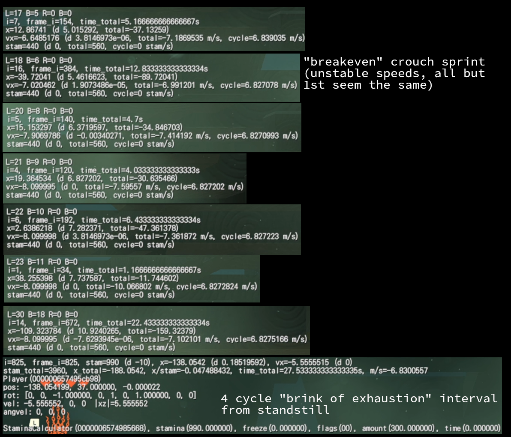

## Sprint stamina depletion
- sprinting out of a stationary crouch is 3 stamina-sprint-depletion frames cheaper than sprinting out of a walk. ~~This probably has something to do with crouch throw sprinting~~ (idk I'll get to that)
- ending sprint on the last possible frame before exhaustion saves 20 stamina-recharge frames
- oops the first message that says `(setup for crouch walk)` is supposed to be `(setup for crouch standstill)`

test_sprint_stamina_misc.mp4 <a href="../media/test_sprint_stamina_misc.mp4" download>(download)</a>
<video src="../media/test_sprint_stamina_misc.mp4" controls></video>

[test_sprint_stamina_misc.as](https://github.com/aquacluck/totk-tas-docs/blob/main/scripts//test_sprint_stamina_misc.as) [(download)](../scripts/test_sprint_stamina_misc.as)

[thanks dt for your stamina notes](https://discord.com/channels/1086729144307564648/1117622784047190127/1328908146390990979):
```
Notes:
  - A single wheel of stamina is 1000 stamina (each Stamina Vessel grants an additional 200 for a max of 3000 with all three wheels)
  - This assumes 30 fps - some of these values will be dynamically adjusted based on fps as the game targets stamina per second

Stamina Recovery:
  - The stamina recovered per second is equal to MaxStamina / 1000 * StaminaRecoverAmount
    - StaminaRecoverAmount is normally 300, but in quicksand, it becomes 160
  - There is a 10 frame delay before stamina recovery starts (30 frames if Link runs out of stamina)

Stamina Usage:
  - Depending on the action, stamina can either be depleted in one big chunk, or be depleted at a constant rate (e.g. firing an arrow midair vs sprinting)
  - Gravity interpolation between two bounds works as follows:
    float InterpolateWithGravity(float value_normal, float value_low_grav) {
        float gravity = GetGravityScale();

        if (gravity > 1.0f) return value_normal;

        if (gravity < 0.25f) return value_low_gravity;

        return (value_normal - value_low_grav) / 0.75f * (gravity - 0.25f) + value_low_grav;
    }
  - ChargeAttackStaminaRate is 0.5 if the buff is active, else 1.0
  - RainClimbStaminaRate is 1.2 if it's raining, else 1.0
  - ClimbSlipSpeed is a random value between 0.4 and 0.5
  - WallJumpStaminaRate is 0.5 if the buff is active, else 1.0
  - SwimAccelStaminaRate is 0.25 if the buff is active, else 1.0
  - WeaponChargeSpeedRate is 1.0, x2.0 if the weapon has quick charge, x2.0 if the charge speed buff is active
  - Chunked Depletions:
    - Jumping in quicksand: 310
    - Firing an arrow in bullet time: 310
    - Firing an arrow in bullet time (in low-gravity): 100
    - Initiating a charge attack: 250 * ChargeAttackStaminaRate
    - Climb jump: 310 * WallJumpStaminaRate * RainClimbStaminaRate
    - Slipping while climbing: 150 * 2 * ClimbSlipSpeed
    - Ladder jump: 300
    - Crouch step in quicksand: 310
    - Pressing sprint while moving: 20
    - Pressing sprint while already sprinting: 50 (stacks with the previous one)
    - Initiating Earthwake charge: 250
    - Zora Helm spin attack: 125 * SwimAccelStaminaRate
    - Swim dash: 125 * SwimAccelStaminaRate
    - Uncharged charge attack (quick spin): 250 * ChargeAttackStaminaRate
  - Constant Rate Depletions (per second rates):
    - Jumping out of a sprint: InterpolateWithGravity(300, 150)
    - Cucco gliding: 28
    - Walking in quicksand: 400
    - Two-handed weapon spin attack: 300 * ChargeAttackStaminaRate
    - Climbing: 36.5 * WallAngleRate * DirectionRate * RainClimbStaminaRate * DeltaDistance
      - WallAngleRate is equal to (1.0 + (|WallAngle| - 90.0) / 70.0) if WallAngle >= 90.0, otherwise it's equal to (0.5 + (|WallAngle| - 50.0) / 40.0 * 0.5)
        - WallAngle is 90.0 for a wall perpendicular to the ground, >90.0 for a wall angled towards Link, and <90.0 for a wall angled away from Link
      - DirectionRate is equal to 0.5 if climbing downwards, otherwise if there is left stick movement, it is equal to (0.5 + 0.5 * (1.0 - |Angle| / PI/2), else 1.1
        - Angle is relative to straight up (left is PI/2, right is -PI/2)
      - DeltaDistance is the distance traveled in a single frame
    - Crouch walking in quicksand: 400
    - Sprinting: 300
    - Paragliding: 28
    - Riding a bucking horse/lynel: 400
    - Charging Earthwake: 250
    - Swimming: 30
    - Swimming with no armor: 24
    - Charging a charge attack: 250 * ChargeAttackStaminaRate * WeaponChargeSpeedRate
```

## Sprint initial acceleration
Logs distance and cumulative velocity per frame for several sprint begin methods:
- standstill: 4 fr to full sprint from 0, 15s avg: 8.052989 m/s
- walk: 7 fr to full sprint from 5.5555415 m/s, 15s avg: 8.077755 m/s
- crouch walk: 2 fr to full sprint, from 2.1051245 m/s, 15s avg: 8.086926 m/s
- crouch standstill: 5 fr to full sprint from 0, 15s avg: 8.034989 m/s

I'm not sure how to weigh this against stamina cost and any pre-sprint walk time, it might ultimately depend on the situation. Obviously the average of the method that starts slowest will always have the slowest average in isolation like this since sprint speed is constant, but it's nice to have some reference points on distance or cumulative average speed at different frames.

test_sprint_initial_acceleration_long.mp4 <a href="../media/test_sprint_initial_acceleration_long.mp4" download>(download)</a>
<video src="../media/test_sprint_initial_acceleration_long.mp4" controls></video>

[test_sprint_initial_acceleration.as](https://github.com/aquacluck/totk-tas-docs/blob/main/scripts/test_sprint_initial_acceleration.as) [(download)](../scripts/test_sprint_initial_acceleration.as)

## "Breakeven" crouch sprint -vs- normal "brink of exhaustion" interval sprint
- see `test_sprint2.as` and `test_sprint2-normal.mp4` for normal sprint, `test_sprint2-ctts.as` for that and `test_sprint2-ctts-17-5.mp4` video example
- "breakevens" are sprint patterns consuming 0 stamina. Other patterns are not explored here.
- all breakevens seem the same average speed, except for the fastest working breakeven rhythm at LStick=17 B=5. This one seems slightly faster than the normal sprint+rest rhythm's average speed
- I'll say normal sprint+rest averages 6.830m/s and the 17-5 crouch sprint averages 6.839m/s. This is ~0.13% faster if accurate.
- (average speeds over time should be compared with salt -- the first few frames from standstill are not well adjusted for. I suspect normal sprint+rest average would slowly continue dropping over time, so hopefully any gains here are erring on the side of pessimism. Cycle times should be fine.)



test_sprint2-ctts-17-5.mp4 <a href="../media/test_sprint2-ctts-17-5.mp4" download>(download)</a>
<video src="../media/test_sprint2-ctts-17-5.mp4" controls></video>

test_sprint2-normal.mp4 <a href="../media/test_sprint2-normal.mp4" download>(download)</a>
<video src="../media/test_sprint2-normal.mp4" controls></video>

[test_sprint2.as](https://github.com/aquacluck/totk-tas-docs/blob/main/scripts/test_sprint2.as) [(download)](../scripts/test_sprint2.as)

[test_sprint2-ctts.as](https://github.com/aquacluck/totk-tas-docs/blob/main/scripts/test_sprint2-ctts.as) [(download)](../scripts/test_sprint2-ctts.as)

